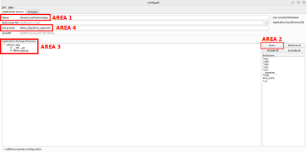
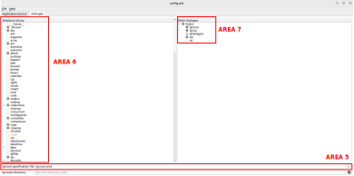

# PyQt-CroM

<a id="purpose"></a>
## What is it?

:dart: PyQt-CroM is a tool to create cross-platform apps using only [Python](https://www.python.org/) and the [Qt Framework](https://www.qt.io/product/framework).


:mortar_board: PyQt-CroM demonstrates the potential of [pyqtdeploy](https://pypi.org/project/pyqtdeploy/) while optimising the tool.

## Who is it for?

:busts_in_silhouette: PyQt-CroM is mainly aimed at the following groups.


## Why bother?

:seedling: There are various reasons to create yet another cross-platform app generation tool (especially based on Python and the [Qt framework](https://www.qt.io/product/framework)):

* Javascript is the current leading language for cross-platform app development frameworks (e.g. [React Native](https://reactnative.dev/), [Nodejs](https://nodejs.org/en), [Ionic](https://ionicframework.com/)). However, Javascript is harder to pick up and learn for beginners than Python. Furthermore, Python comes with built-in modules and an extensive list of libraries, whereas Javascript only comes with a few powerful libraries, which makes Javascript still less handy and less flexible for intermediate and expert developers.

* [Flutter](https://flutter.dev/) is gaining traction in the cross-platform ecosystem, as it is fast, flexible and allows native feature access. Its base language is [Dart language](https://dart.dev/), which is easy to learn, fast, performant and documented, but suffers from a lack of online resources and community support (as it is fairly recent). On the contrary, Python benefits from countless useful online resources, as well as a large and active community.

* No-code or low-code platforms (e.g. [Bubble](https://bubble.io/)) are a great option for beginners as they help them prototype quickly, but are very limited in functionalities sought after by intermediate and expert developers. Some platforms (e.g. [FlutterFlow](https://flutterflow.io/)) enable the use of code to extend existing capabilities, but this increases the the level of access requirements for beginners. Python is a great competitor to low-code platforms as it is accessible to beginners, and is also a great competitor to more advanced platforms, as it boasts a large range of libraries, making it easy to customise features and create advanced functionalities.

* [Kivy](https://kivy.org/) and [BeeWare](https://beeware.org/) are the most famous cross-platform app development frameworks based on Python. Even though [Kivy](https://kivy.org/) is more focused on non-native user interface and [BeeWare](https://beeware.org/) is more focused on native feel, they can't provide both options in one framework simultaneously. Furthermore, they both lack community support and good documentation. On the contrary, [PyQt](https://riverbankcomputing.com/software/pyqt/intro) relies relies on the [Qt framework](https://www.qt.io/product/framework) which is the leader in GUI apps (thanks to an active community) and allows to develop apps with a native feel ([QtWidgets](https://doc.qt.io/qt-6/qtwidgets-index.html)) or a more custom and standardised look ([QtQuick](https://doc.qt.io/qt-6/qtquick-index.html)) according to [Qt framework comparison](https://www.qt.io/resources/videos/qt-widgets-or-qt-quick).

* [Tkinter](https://docs.python.org/3/library/tkinter.html) relies on Python and the code is stable, however the user interface is not appealing and the code is hard to debug. On the contrary, [PyQt](https://riverbankcomputing.com/software/pyqt/intro) makes Qt components directly accessible from the Python language, which makes it easy to organise, customise and debug code (thanks to recognised Qt expertise).

* [PySide](https://wiki.qt.io/Qt_for_Python) is developed by Qt, but surprisingly requires a lot of setup and various tools to convert from a script to a mobile app for instance, as expressed by Qt itself on [Qt website](https://www.qt.io/blog/taking-qt-for-python-to-android). Even though [pyqtdeploy](https://riverbankcomputing.com/software/pyqtdeploy/intro) also requires a lot of setup to convert a [PyQt](https://riverbankcomputing.com/software/pyqt/intro) script into a cross-platform app, the process is robust and reliable.

:heavy_check_mark: The tool [pyqtdeploy](https://riverbankcomputing.com/software/pyqtdeploy/intro) is still not perfect, but the limitations are non-critical for the target audience:

* Qt documentation is great for C++, but less for Python
* [Pyqtdeploy](https://riverbankcomputing.com/software/pyqtdeploy/intro) documentation is almost non-existent
* The size of generated apps is usually bigger than expected, because they need to include a Python interpreter if not available on the OS (e.g. Android apps).

:sunglasses: The aforementioned limitations constitute obstacles that can be tackled by PyQt-CroM.

<a id="toc"></a>
## Table of Contents

* [1. Getting started](#getting-started)
    * [1.1. Check the pre-requisites](#pre-requisites)
    * [1.2. Download the github repo](#github-repo-download)
    * [1.3. Setup the path to the main repo](#repo-path-setup)
    * [1.4. Setup the python virtual environment](#virtual-environment-setup)
        * [1.4.1. Create a virtual environment with python3 installed on your machine](#virtual-environment-creation)
        * [1.4.2. Activate your virtual environment](#virtual-environment-activation)
        * [1.4.3. Install the necessary pip packages](#pip-package-installation)
        * [1.4.4. Test the demo app in your virtual environment](#virtual-environment-app-test)
    * [1.5. Install the external dependencies](#external-dependency-installation)
        * [1.5.1. Download a set of external dependencies for pyqtdeploy](#external-dependency-download)
        * [1.5.2. Install Zlib for pyqtdeploy](#zlib-installation)
        * [1.5.3. Install Java for Android Studio](#java-installation)
        * [1.5.4. Install Android Studio](#android-studio-installation)
        * [1.5.5. Install correct Android SDK and Tools](#android-sdk-installation)
        * [1.5.6. Install Android NDK matching with Qt version](#android-ndk-installation)
        * [1.5.7. Install Qt from the installer](#qt-installation)
    * [1.6. Setup the environment variables](#environment-variable-setup)
    * [1.7. Build the app with pyqtdeploy](#app-build)
    * [1.8. Run the app](#app-run)
* [2. Generating your own app](#custom-app)
    * [2.1. Create your python package](#package-creation)
    * [2.2. Update the sysroot](#sysroot-configuration)
    * [2.3. Configure the pdt](#pdt-configuration)
    * [2.4. Build the app](#app-generation)
    * [2.5. Debug the app](#app-debugging)
* [3. Enhancing your app](#app-enhancement)
* [4. Releasing your app](#app-release)
* [5. Troubleshooting](#troubleshooting)
* [6. Roadmap](#roadmap)
* [7. Credits](#credits)
* [8. Support](#support)

<a id="getting-started"></a>
## 1. Getting started 

:mag: This tutorial guides you through the process of generating a cross-platform app from a simple PyQt5 demo app.

:trophy: By the end of the tutorial, you will be able to launch the simple PyQt5 demo app from your Android phone:

<a id="pyqt5-demo-app-android-video"></a>

<video src="https://github.com/achille-martin/pyqt-crom/assets/66834162/853bc3f3-d3dc-45af-b03a-4c6c8b1f3939">
   <p>PyQt5 demo app Android platform video</p>
</video>

<a id="pre-requisites"></a>
### 1.1. Check the pre-requisites 

Specs of Linux machine used:

- `Ubuntu 22.04` (EOL April 2032) with around 40-50GB available (to install the dependencies)
- `Python 3.10.12` (EOL October 2026) pre-installed on Ubuntu 22

:bulb: _Refer to [Virtual Machine Setup](doc/troubleshooting/common_issues.md#virtual-machine-setup) if you don't have a Linux OS available on your machine._

Specs of target OS:

- `Android 9.0` as targeted Android features (default)
- `Android 9.0` as minimum Android version to run the app (default)

<a id="github-repo-download"></a>
### 1.2. Download the github repo 

Use the HTTPS method if you don't have a Github account:

```
cd $HOME/Documents \
&& git clone https://github.com/achille-martin/pyqt-crom.git
```

Use the SSH method if you have a Github account (and [SSH key setup](https://docs.github.com/en/authentication/connecting-to-github-with-ssh)):

```
cd $HOME/Documents \
&& git clone git@github.com:achille-martin/pyqt-crom
```

<a id="repo-path-setup"></a>
### 1.3. Setup the path to the main repo

:warning: _We will use `PYQT_CROM_DIR` as the variable containing the path to the main repo._

Add the variable to your `.bashrc` with:

```
printf "%s\n" \
"" \
"# Environment variable for PyQt-CroM path" \
"export PYQT_CROM_DIR=$HOME/Documents/pyqt-crom" \
"" \
>> $HOME/.bashrc \
&& source $HOME/.bashrc
```

<a id="virtual-environment-setup"></a>
### 1.4. Setup the python virtual environment

<a id="virtual-environment-creation"></a>
#### 1.4.1. Create a virtual environment with python3 installed on your machine

```
sudo apt-get update \
&& sudo apt-get install python3-pip \
&& python3 -m pip install --upgrade pip \
&& sudo apt-get install python3-virtualenv \
&& cd $PYQT_CROM_DIR \
&& mkdir -p venv \
&& cd venv \
&& virtualenv pyqt-crom-venv -p python3 \
&& cd ..
```

<a id="virtual-environment-activation"></a>
#### 1.4.2. Activate your virtual environment

```
source $PYQT_CROM_DIR/venv/pyqt-crom-venv/bin/activate
```

:bulb: _To exit the virtual environment, type in your terminal `deactivate`._

<a id="pip-package-installation"></a>
#### 1.4.3. Install the necessary pip packages

Make sure that pip3 (pip for python3) has been upgraded to v23.3.2 in the virtual environment with:

```
pip3 --version
```

If pip3 needs to be upgraded, run the command:

```
pip3 install --upgrade pip
```

Install the pip packages in the virtual environment with:

```
cd $PYQT_CROM_DIR \
&& pip3 cache purge \
&& pip3 install -r requirements.txt
```

:bulb: _You can confirm the installed pip packages with `pip3 list --local`._

<a id="virtual-environment-app-test"></a>
#### 1.4.4. Test the demo app in your virtual environment

```
cd $PYQT_CROM_DIR/examples/demo/demo_project/demo_pkg \
&& python3 demo_app.py
```

The PyQt5 demo app will start and you can confirm that it is displayed properly on your machine:
- Click the button
- An alert message is displayed stating that you have clicked the button

<video src="https://github.com/achille-martin/pyqt-crom/assets/66834162/250e9449-bcde-437c-8cfd-2c4b71514736">
   <p>PyQt5 demo app Linux platform video</p>
</video>

<a id="external-dependency-installation"></a>
### 1.5. Install the external dependencies

<a id="external-dependency-download"></a>
#### 1.5.1. Download a set of external dependencies for pyqtdeploy

Download the sources with:

```
cd $PYQT_CROM_DIR/utils/resources \
&& chmod +x download_sources.sh \
&& ./download_sources.sh
```

:bulb: _You can confirm that the list of packages required matches with the versions from `$PYQT_CROM_DIR/examples/demo/demo_project/sysroot.toml`._

<a id="zlib-installation"></a>
#### 1.5.2. Install Zlib for pyqtdeploy

Install zlib on Ubuntu with:

```
sudo apt install zlib1g-dev
```

Zlib is required by the pyqtdeploy project `$PYQT_CROM_DIR/examples/demo/demo_project/config.pdt` to correctly identify the dependencies from the `$PYQT_CROM_DIR/examples/demo/demo_project/sysroot.toml`.

:bulb: _Sysroot setup tips can be obtained from [Riverbank website](https://www.riverbankcomputing.com/static/Docs/pyqtdeploy/sysroot.html)._

<a id="java-installation"></a>
#### 1.5.3. Install Java for Android Studio

Install stable java JDK 11 available for your Ubuntu distribution and tested with Gradle:

```
sudo apt install openjdk-11-jdk openjdk-11-jre
```

Set the default java and javac version to 11 using:

```
sudo update-alternatives --config java \
&& sudo update-alternatives --config javac
```

:hand: _Confirm the version with `java -version && javac -version` which should be `v11.0.21`._

<a id="android-studio-installation"></a>
#### 1.5.4. Install Android Studio

Download Android Studio version `2023.1.1.26` with:

```
sudo apt-get install wget \
&& cd $HOME/Downloads \
&& wget https://redirector.gvt1.com/edgedl/android/studio/ide-zips/2023.1.1.26/android-studio-2023.1.1.26-linux.tar.gz
```

Move the contents of the downloaded `tar.gz` to your `$HOME` directory using:

```
cd $HOME/Downloads \
&& tar -xvf android-studio-2023.1.1.26-linux.tar.gz \
&& mv android-studio $HOME
```

Start the installation with:

```
cd $HOME/android-studio/bin \
&& ./studio.sh
```

:bulb: _Tip: if there is an issue with android studio start, use `sudo ./studio.sh`._

The Android Studio installer will start:
- Do not import settings
- Select custom installation if possible
- Pick the default Android SDK
- Deselect Virtual Device if you don't need it for testing
- Keep a note of the Sdk installation path, which should be `$HOME/Android/Sdk`
- Start the download (unless you want to install extra features)
- Close Android Studio

:hand: _Make sure that the default SDK has been installed in `$HOME/Android/Sdk` and that `$HOME/Android/Sdk/platforms` contains `android-28` folder only.
The reason why android-28 (corresponding to Android v9.0) is selected is because there are restrictions depending on the Java version installed and the Qt version installed.
If `$HOME/Android/Sdk/platforms` does not contain `android-28` folder only, follow the instructions at the [next step](#android-sdk-installation) to set things up correctly._

<a id="android-sdk-installation"></a>
#### 1.5.5. Install correct Android SDK and Tools

- Restart Android Studio with `cd $HOME/android-studio/bin && ./studio.sh` (skip / cancel if no SDK found)
- On the menu screen, click on `more actions` and then `SDK manager`
    - Make sure that you are in the Settings -> Languages & Frameworks -> Android SDK
    - Make sure that in the `SDK Platforms` tab, the following is installed (Show package details and unhide obsolete packages): (Android 9.0) Android SDK Platform 28 and Sources for Android 28.
    - Remove any additional unneeded package from the list.
    - Apply changes for `SDK Platforms` tab.
    - Make sure that in the `SDK Tools` tab, the following is installed (Show package details and unhide obsolete packages): (Android SDK Build-Tools 34) v28.0.3, Android Emulator any version, Android SDK Tools (Obsolete) v26.1.1.
    - Remove any additional unneeded and interfering package from the list.
- Close Android Studio
- Download SDK Platform-Tools v28.0.3 to match the SDK Build-Tools version and add it to your SDK folder using:

```
cd $HOME/Downloads \
&& wget https://dl.google.com/android/repository/platform-tools_r28.0.3-linux.zip \
&& sudo apt-get install unzip \
&& unzip platform-tools_r28.0.3-linux.zip \
&& rm -r $HOME/Android/Sdk/platform-tools \
&& mv platform-tools $HOME/Android/Sdk
```

<a id="android-ndk-installation"></a>
#### 1.5.6. Install Android NDK working with Qt version

- Restart Android Studio with `cd $HOME/android-studio/bin && ./studio.sh` (skip / cancel if no SDK found)
- On the menu screen, click on `more actions` and then `SDK manager`
    - Make sure that you are in the Settings -> Languages & Frameworks -> Android SDK
    - Make sure that in the `SDK Tools` tab, the following is installed: NDK Side-By-Side v21.4.7075529 (equivalent to r21e). According to the [Qt Website](https://doc.qt.io/qt-5/android-getting-started.html), this is the one recommended for Qt5.15.2.
- Close Android Studio

:hand: _Make sure that `$HOME/Android/Sdk/ndk/21.4.7075529/platforms` contains the folder `android-28`._

:bulb: _The NDK corresponds to the minimum version required to run the app. Technically, you could choose a lower version than Android API 9.0 (android-28)._

<a id="qt-installation"></a>
#### 1.5.7. Install Qt from the installer

Download the Qt version which matches the one in `$PYQT_CROM_DIR/examples/demo/demo_project/sysroot.toml` from the open source online installer:

```
sudo apt-get install libxcb-xfixes0-dev \
&& cd $HOME/Downloads \
&& wget https://d13lb3tujbc8s0.cloudfront.net/onlineinstallers/qt-unified-linux-x64-4.6.1-online.run \
&& chmod +x qt*.run \
&& ./qt-unified-linux-x64-4.6.1-online.run
```

A Qt window will appear on which you can sign up:
- Verify your email and register as an individual (no need for location)
- Restart the Qt installer with: `cd $HOME/Downloads && ./qt-unified-linux-x64-4.6.1-online.run`
- Log in, state that you are an individual and not a company
- If possible, select "Custom installation" and make sure to only setup `Qt5.15.2` (and other packages you might want)
- Setup will start
- Select folder location `$HOME/Qt5.15.2`
- Installation will start

:hand: _Make sure that you can access `$HOME/Qt5.15.2/5.15.2` and that the folder `android` is located inside of it._

<a id="environment-variable-setup"></a>
### 1.6. Setup the environment variables

Load the environment variables on terminal startup with:

```
printf "%s\n" \
"" \
"# Load extra environment variables for PyQt-CroM" \
"source $PYQT_CROM_DIR/utils/resources/path_setup.sh" \
"" \
>> $HOME/.bashrc \
&& source $HOME/.bashrc
```

<a id="app-build"></a>
### 1.7. Build the app with pyqtdeploy

Start the building process of the .apk with:

```
cd $PYQT_CROM_DIR/utils \
&& python3 build_app.py --pdt $PYQT_CROM_DIR/examples/demo/demo_project/config.pdt --jobs 1 --target android-64 --qmake $QT_DIR/android/bin/qmake --verbose
``` 
:hourglass_flowing_sand: _Let the app build (it may take a while). The app is built when you see "BUILD SUCCESSFUL"._

:bulb: _The Android Manifest, `build.gradle` and `gradle.properties` can be checked at debug stage in `$PYQT_CROM_DIR/examples/demo/demo_project/build-android-64/android-build`._

<a id="app-run"></a>
### 1.8. Run the app 

The generated `DemoCrossPlatformApp.apk` can be found in `$PYQT_CROM_DIR/examples/demo/demo_project/releases/<build_date>`.

You can then either:
- Copy, install and run the .apk onto your phone (>=Android v9.0)
- Install [BlueStacks](https://www.bluestacks.com/download.html) on Windows, enable hyper-V, open `my games` and install the .apk, run the app offline
- Setup a virtual device in Android Studio, install the app and run it on the virtual device

:trophy: Congratulations! You have completed the tutorial. You can view the [demo app running on an Android phone](#pyqt5-demo-app-android-video).

[:arrow_heading_up: Back to TOP](#toc) 

<a id="custom-app"></a>
## 2. Generating your own app

:mag: This section describes the steps to generate an `Android` app (.apk) from a custom `PyQt5` app.

:bulb: _Make sure to go through the [Getting Started tutorial](#getting-started) to correctly setup your machine and environment._

:warning: _In this section, placeholders are defined between `<>`. For instance, `<pkg_name>` can be `demo_pkg` or `test_pkg`._

<a id="package-creation"></a>
### 2.1. Create your python package

Start by creating a project folder:
* Create a folder `<project_name>` wherever you want (and remember the absolute path of its parent folder referred to as `<absolute_path>`)

Inside of the project folder, create a python package to hold your `PyQt5` app:
* Create a folder `<project_name>/<pkg_name>`
* Populate `<project_name>/<pkg_name>` with at least `__init__.py` file and a `<main_file_name>.py` script (you can add more files if required by your package)

_Note that the `<main_file_name>.py` must contain a unique `main()` function (or any similar distinctive entry point)._

:bulb: _An example of python package is given in the [demo project folder](examples/demo/demo_project/demo_pkg)._

<a id="sysroot-configuration"></a>
### 2.2. Configure the sysroot

Inside of your `<project_name>` folder, add the sysroot config to specify application dependencies:
* Create a file called `sysroot.toml` and populate it with all the modules used by your app.

_For instance, if you imported `QtSql` in your `PyQt5` app, then you must include `QtSql` in `[PyQt.android] installed_modules`._

:bulb: _An example of sysroot config is given in the [demo project folder](examples/demo/demo_project)._

<a id="pdt-configuration"></a>
### 2.3. Configure the pdt

Inside of your `<project_name>` folder, add the pdt config to specify python dependencies and build requests:
* Create a file called `config.pdt` and configure it

To configure the `config.pdt` file, you need to understand and use the various areas shown in the following pictures:



* Open the `config.pdt` file with: `cd <absolute_path>/<project_name> && pyqtdeploy config.pdt`.
* [AREA 1] In the `Application source tab > Name area`, add the `<app_name>` with no spaces. This is the app name shown at export time.
* [AREA 2] In the `Application source tab`, click on the `Scan` button to select your `<project_name>/<pkg_name>` folder.
* [AREA 3] In the `Application source tab > Application Package Directory area`, tick the files and folders you want to include into your application.
* [AREA 4] In the `Application source tab > Entry point area`, add the `<pkg_name>.<main_file_name>:main` to tell where the entry point of your application is.



* [AREA 5] In the `Packages tab > Sysroot specification file area`, click on the file icon to the right to select the desired `sysroot.toml` file.
* [AREA 6] In the `Packages tab > Standard Library area`, tick all the python libraries you have imported in your python application. You can leave the coloured blocks as they import required libraries to build the python application.
* [AREA 7] In the `Packages tab > Core Packages area`, tick all the external packages that you have imported in your python application. You can leave the coloured blocks as they import required libraries to build the python application.
* Save the `config.pdt` with `Ctrl + S` and close it.

:bulb: _An example of pdt config is given in the [demo project folder](examples/demo/demo_project)._

:bulb: _For more information about pdt files, read the [Riverbank website page](https://www.riverbankcomputing.com/static/Docs/pyqtdeploy/pyqtdeploy.html)._

<a id="app-generation"></a>
### 2.4. Build the app

Generate the `<app_name>.apk` file using:

```
cd $PYQT_CROM_DIR/utils \
&& python3 build_app.py --pdt <absolute_path>/<project_name>/config.pdt --jobs 1 --target android-64 --qmake $QT_DIR/android/bin/qmake --verbose
```

:bulb: _The `<app_name>.apk` can be found in the `<absolute_path>/<project_name>/releases/<build_date>` folder._

<a id="app-debugging"></a>
### 2.5. Debug the app

The most nerve-wracking part of deploying an application is the debugging part. 

Therefore, make sure that you have added a logger to your application and that you use an Emulator or a physical device to confirm your expectations.

To setup an Emulator, refer to [Android Emulator setup](doc/troubleshooting/common_issues.md#android-emulator-setup).

[:arrow_heading_up: Back to TOP](#toc)

<a id="app-enhancement"></a>
## 3. Enhancing your app

:mag: This section offers feature examples to enhance your custom PyQt app.

To discover or analyse PyQt5 features, look at the section dedicated to [PyQt5 features](doc/features/pyqt5_features.md).

[:arrow_heading_up: Back to TOP](#toc) 

<a id="app-release"></a>
## 4. Releasing your app

:mag: This section provides a detailed tutorial on how to release your custom app onto main app stores.

To learn more about releasing your own app on app stores, follow the online tutorial.

[:arrow_heading_up: Back to TOP](#toc) 

<a id="troubleshooting"></a>
## 5. Troubleshooting

:mag: This section offers advice to get unstuck when creating your app.

To find out about common setup and running issues, look at the section dedicated to [Common issues](doc/troubleshooting/common_issues.md).

[:arrow_heading_up: Back to TOP](#toc) 

<a id="roadmap"></a>
## 6. Roadmap

:mag: This section describes the broad roadmap to deliver a functional repo.


[:arrow_heading_up: Back to TOP](#toc) 

<a id="credits"></a>
## 7. Credits

Repository created and maintained by [Achille Martin](https://github.com/achille-martin).

:clap: Gigantic thanks to [Phil Thompson](https://pypi.org/user/PhilThompson/), the creator and maintainer of [PyQt](https://riverbankcomputing.com/software/pyqt/intro) and [pyqtdeploy](https://pypi.org/project/pyqtdeploy/).

:heartpulse: Sincere thanks to the well-intentioned international developers who create apps benefitting the community.

_For more information about licencing details, take a look at the section dedicated to [Licencing](doc/licencing/licencing_information.md)._

[:arrow_heading_up: Back to TOP](#toc)

<a id="support"></a>
## 8. Support

:star2: Do you feel that you can make progress with your own projects by converting your PyQt5 apps into cross-platform apps? 

> Please support PyQt-CroM by [starring](https://github.com/achille-martin/pyqt-crom), [advertising](https://github.com/achille-martin/pyqt-crom) and [sponsoring](https://github.com/sponsors/achille-martin) it.

:open_hands: Do you feel stuck with your projects? 

> Get customised help from me on [Fiverr](http://www.fiverr.com/s/3PGbdV).

<a href="https://www.buymeacoffee.com/achille_martin" target="_blank"></a>

<a href="https://github.com/sponsors/achille-martin" target="_blank"></a>

<a href="https://www.fiverr.com/hardioactif39/convert-your-pyqt5-script-into-an-android-application" target="_blank"></a>

[:arrow_heading_up: Back to TOP](#toc)
