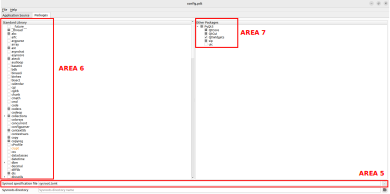

# PyQt-CroM

<a id="overview"></a>
<a id="overview-what"></a>
### What is it?

A tool to create [cross-platform apps](https://www.imaginarycloud.com/blog/what-is-cross-platform-app-development/) using only [Python](https://www.python.org/) and the [Qt Framework](https://www.qt.io/product/framework).


PyQt-CroM demonstrates the capabilities of [pyqtdeploy](https://pypi.org/project/pyqtdeploy/) and optimises its use.

<a id="overview-who"></a>
### Who is it for?

PyQt-CroM is mainly aimed at the following groups.


<a id="overview-why"></a>
### Why bother?

There are various reasons to create yet another cross-platform app generation tool (especially based on Python and the [Qt framework](https://www.qt.io/product/framework)):

* Javascript is the current leading language for cross-platform app development frameworks (e.g. [React Native](https://reactnative.dev/), [Nodejs](https://nodejs.org/en), [Ionic](https://ionicframework.com/)). However, `Javascript is harder to pick up and learn for beginners than Python`. Furthermore, Python comes with built-in modules and an extensive list of libraries, whereas Javascript only comes with a few powerful libraries, which makes `Javascript still less handy and less flexible for intermediate and expert developers`.

* [Flutter](https://flutter.dev/) is gaining traction in the cross-platform ecosystem, as it is fast, flexible and allows native feature access. Its base language is [Dart language](https://dart.dev/), which is easy to learn, fast, performant and documented, but `Dart suffers from a lack of online resources and community support` (as it is fairly recent). On the contrary, Python benefits from countless useful online resources, as well as a large and active community.

* No-code or low-code platforms (e.g. [Bubble](https://bubble.io/)) are a great option for beginners as they help them prototype quickly, but `no-code platforms are very limited in functionalities sought after by intermediate and expert developers`. Some platforms (e.g. [FlutterFlow](https://flutterflow.io/)) enable the use of code to extend existing capabilities, but this increases the the level of access requirements for beginners. Python is a great competitor to low-code platforms as it is accessible to beginners, and is also a great competitor to more advanced platforms, as it boasts a large range of libraries, making it easy to customise features and create advanced functionalities.

* [Kivy](https://kivy.org/) and [BeeWare](https://beeware.org/) are the most famous cross-platform app development frameworks based on Python. Even though [Kivy](https://kivy.org/) is more focused on non-native user interface and [BeeWare](https://beeware.org/) is more focused on native feel, `Kivy and BeeWare can't provide native and non-native feel in one framework simultaneously. Furthermore, they both lack community support and good documentation`. On the contrary, [PyQt](https://riverbankcomputing.com/software/pyqt/intro) relies relies on the [Qt framework](https://www.qt.io/product/framework) which is the leader in GUI apps (thanks to an active community) and allows to develop apps with a native feel ([QtWidgets](https://doc.qt.io/qt-6/qtwidgets-index.html)) or a more custom and standardised look ([QtQuick](https://doc.qt.io/qt-6/qtquick-index.html)) according to [Qt framework comparison](https://www.qt.io/resources/videos/qt-widgets-or-qt-quick).

* [Tkinter](https://docs.python.org/3/library/tkinter.html) relies on Python and the code is stable, however `the user interface in Tkinter is not appealing and the code is hard to debug`. On the contrary, [PyQt](https://riverbankcomputing.com/software/pyqt/intro) makes Qt components directly accessible from the Python language, which makes it easy to organise, customise and debug code (thanks to recognised Qt expertise).

* [PySide](https://wiki.qt.io/Qt_for_Python) is developed by Qt, but surprisingly requires a lot of setup and various tools to convert from a script to a mobile app for instance, as expressed by Qt itself on [Qt website](https://www.qt.io/blog/taking-qt-for-python-to-android). Even though [pyqtdeploy](https://riverbankcomputing.com/software/pyqtdeploy/intro) also requires a lot of setup to convert a [PyQt](https://riverbankcomputing.com/software/pyqt/intro) script into a cross-platform app, the process is robust and reliable.

:heavy_check_mark: The tool [pyqtdeploy](https://riverbankcomputing.com/software/pyqtdeploy/intro) is still not perfect, but the limitations are non-critical for the target audience:

* Qt documentation is great for C++, but less for Python
* [Pyqtdeploy](https://riverbankcomputing.com/software/pyqtdeploy/intro) documentation is almost non-existent
* The size of generated apps is usually bigger than expected, because they need to include a Python interpreter if not available on the OS (e.g. Android apps).

The aforementioned limitations constitute obstacles that can be tackled by PyQt-CroM.

<a id="toc"></a>
## Table of Contents

* [Overview](#overview)
* [1. Getting started](#getting-started)
    * [1.1. Check the pre-requisites](#pre-requisites)
    * [1.2. Download the github repo](#github-repo-download)
    * [1.3. Setup the path to the main repo](#repo-path-setup)
    * [1.4. Setup the python virtual environment](#virtual-environment-setup)
        * [1.4.1. Create a python virtual environment](#virtual-environment-creation)
        * [1.4.2. Activate your virtual environment](#virtual-environment-activation)
        * [1.4.3. Install the necessary pip packages](#pip-package-installation)
        * [1.4.4. Test the demo app in your virtual environment](#virtual-environment-app-test)
    * [1.5. Install the external dependencies](#external-dependency-installation)
        * [1.5.1. Download a set of external dependencies for pyqtdeploy](#external-dependency-download)
        * [1.5.2. Install zlib for pyqtdeploy](#zlib-installation)
        * [1.5.3. Install Java for Android Studio](#java-installation)
        * [1.5.4. Install Android Studio](#android-studio-installation)
        * [1.5.5. Install correct Android SDK and Tools](#android-sdk-installation)
        * [1.5.6. Install Android NDK matching with Qt version](#android-ndk-installation)
        * [1.5.7. Install Qt from the installer](#qt-installation)
    * [1.6. Setup the environment variables](#environment-variable-setup)
    * [1.7. Build the app with pyqtdeploy](#app-build)
    * [1.8. Run the app](#app-run)
* [2. Generating your own app](#custom-app)
    * [2.1. Create your python package](#package-creation)
        * [2.1.1. Advanced python package](#package-creation-advanced")
        * [2.1.2. Non-python file management](#package-creation-non-python-management)
        * [2.1.3. Standard python package](#package-creation-standard)
    * [2.2. Update the sysroot](#sysroot-configuration)
        * [2.2.1. Specify non-python modules](#sysroot-non-python-modules)
        * [2.2.2. Specify non-standard python modules](#sysroot-non-standard-python-modules)
            * [2.2.2.1. Modules with wheels](#sysroot-non-standard-python-modules-with-wheels)
            * [2.2.2.2. Modules without wheels](#sysroot-non-standard-python-modules-without-wheels)
        * [2.2.3. Specify standard python modules](#sysroot-standard-python-modules)
        * [2.2.4. Create custom plugins](#sysroot-custom-plugins)
    * [2.3. Configure the pdt](#pdt-configuration)
    * [2.4. Build the app](#app-generation)
    * [2.5. Debug the app](#app-debugging)
* [3. Enhancing your app](#app-enhancement)
* [4. Releasing your app](#app-release)
* [5. Troubleshooting](#troubleshooting)
* [6. Roadmap](#roadmap)
* [7. Credits](#credits)
* [8. Support](#support)

<a id="getting-started"></a>
## 1. Getting started 

> :mag: **Info**: This tutorial guides you through the process of generating a cross-platform app from a simple PyQt5 demo app.

> :trophy: **Target**: By the end of the tutorial, you will be able to launch the following simple PyQt5 demo app from your Android phone.

<a id="pyqt5-demo-app-android-video"></a>

<video src="https://github.com/achille-martin/pyqt-crom/assets/66834162/853bc3f3-d3dc-45af-b03a-4c6c8b1f3939">
   <p>PyQt5 demo app Android platform video</p>
</video>

<a id="pre-requisites"></a>
### 1.1. Check the pre-requisites 

> :warning: **Warning**: It is highly recommended to use the following machine specs, as support can be provided.

Specs of Linux machine used:

- `Ubuntu 22.04` (EOL April 2032) with around 40-50GB available (to install the dependencies)
- `Python 3.10.12` (EOL October 2026) pre-installed on Ubuntu 22

> :bulb: **Tip**: Refer to [Virtual Machine Setup](docs/troubleshooting/common_issues.md#virtual-machine-setup) if you don't have a Linux OS available on your machine.

Specs of target OS:

- `Android 9.0` as targeted Android features (default)
- `Android 9.0` as minimum Android version to run the app (default)

<a id="github-repo-download"></a>
### 1.2. Download the github repo 

Use the relevant method to download the github repo

<table style="width:100%">
    <!-- Headers -->
    <tr>
        <th align="center" style="width:30%"> CONDITION </th> <!-- Col 1 -->
        <th align="center" style="width:10%"> METHOD </th> <!-- Col 2 -->
        <th align="center"> COMMAND </th> <!-- Col 3 -->
    </tr>
    <!-- Row 1 -->
    <tr>
        <td>You don't have a <a href="https:https://github.com/">Github account</a></td>
        <td>HTTPS</td>
        <td><pre><code class="language-python">cd $HOME/Documents &&
git clone https://github.com/achille-martin/pyqt-crom.git</code></pre</td>
    </tr>
    <!-- Row 2 -->
    <tr>
        <td>You have a <a href="https:https://github.com/">Github account</a> and <a href="https://docs.github.com/en/authentication/connecting-to-github-with-ssh">SSH keys setup</a></td>
        <td>HTTPS</td>
        <td><pre><code class="language-python">cd $HOME/Documents &&
git clone git@github.com:achille-martin/pyqt-crom</code></pre</td>
    </tr>
</table>

<a id="repo-path-setup"></a>
### 1.3. Setup the path to the main repo

> :triangular_flag_on_post: **Important**: We will use `PYQT_CROM_DIR` as the variable containing the path to the main repo.

Add the variable to your `.bashrc` with:

```
text_to_add="
# Environment variable for PyQt-CroM path
export PYQT_CROM_DIR=$HOME/Documents/pyqt-crom
" &&
printf "$text_to_add" >> $HOME/.bashrc &&
source $HOME/.bashrc
```

<a id="virtual-environment-setup"></a>
### 1.4. Setup the python virtual environment

<a id="virtual-environment-creation"></a>
#### 1.4.1. Create a python virtual environment

```
sudo apt-get update &&
sudo apt-get install python3-pip &&
python3 -m pip install --upgrade pip &&
sudo apt-get install python3-virtualenv &&
cd $PYQT_CROM_DIR &&
mkdir -p venv &&
cd venv &&
virtualenv pyqt-crom-venv -p python3 &&
cd ..
```

<a id="virtual-environment-activation"></a>
#### 1.4.2. Activate your virtual environment

```
source $PYQT_CROM_DIR/venv/pyqt-crom-venv/bin/activate
```

> :bulb: **Tip**: To exit the virtual environment, type in your terminal `deactivate`.

<a id="pip-package-installation"></a>
#### 1.4.3. Install the necessary pip packages

Make sure that pip3 (pip for python3) has been upgraded to v23.3.2 (or later) in the virtual environment with:

```
pip3 --version
```

If pip3 needs to be upgraded, run the command:

```
pip3 install --upgrade pip
```

Install the pip packages in the virtual environment with:

```
cd $PYQT_CROM_DIR &&
pip3 cache purge &&
pip3 install -r requirements.txt
```

:bulb: _You can confirm the installed pip packages with `pip3 list --local`._

<a id="virtual-environment-app-test"></a>
#### 1.4.4. Test the demo app in your virtual environment

```
cd $PYQT_CROM_DIR/examples/demo/demo_project/demo_pkg &&
python3 demo_app.py
```

The PyQt5 demo app will start and you can confirm that it is displayed properly on your machine:
- Click the button
- An alert message is displayed stating that you have clicked the button

<video src="https://github.com/achille-martin/pyqt-crom/assets/66834162/250e9449-bcde-437c-8cfd-2c4b71514736">
   <p>PyQt5 demo app Linux platform video</p>
</video>

<a id="external-dependency-installation"></a>
### 1.5. Install the external dependencies

<a id="external-dependency-download"></a>
#### 1.5.1. Download a set of external dependencies for pyqtdeploy

Download the sources with:

```
cd $PYQT_CROM_DIR/utils/bash &&
chmod +x download_sources.sh &&
./download_sources.sh
```

:bulb: _You can confirm that the list of packages required matches with the versions from `$PYQT_CROM_DIR/examples/demo/demo_project/sysroot.toml`._

<a id="zlib-installation"></a>
#### 1.5.2. Install zlib for pyqtdeploy

Install zlib on Ubuntu with:

```
sudo apt install zlib1g-dev
```

`zlib` component is required by `Qt` component in `$PYQT_CROM_DIR/examples/demo/demo_project/sysroot.toml` to be pre-installed, but there is no default way specified in the `zlib` component itself to install it. Therefore, the installation method needs to be explicitly specified in `$PYQT_CROM_DIR/examples/demo/demo_project/sysroot.toml`.

:bulb: _Sysroot setup tips can be obtained from [Riverbank website](https://www.riverbankcomputing.com/static/Docs/pyqtdeploy/sysroot.html)._

<a id="java-installation"></a>
#### 1.5.3. Install Java for Android Studio

Install stable java JDK 11 available for your Ubuntu distribution and tested with Gradle:

```
sudo apt install openjdk-11-jdk openjdk-11-jre
```

Set the default java and javac version to 11 using:

```
sudo update-alternatives --config java &&
sudo update-alternatives --config javac
```

:hand: _Confirm the version with `java -version && javac -version` which should be `v11.0.21`._

<a id="android-studio-installation"></a>
#### 1.5.4. Install Android Studio

Download Android Studio version `2023.1.1.26` with:

```
sudo apt-get install wget &&
cd $HOME/Downloads &&
wget https://redirector.gvt1.com/edgedl/android/studio/ide-zips/2023.1.1.26/android-studio-2023.1.1.26-linux.tar.gz
```

Move the contents of the downloaded `tar.gz` to your `$HOME` directory using:

```
cd $HOME/Downloads &&
tar -xvf android-studio-2023.1.1.26-linux.tar.gz &&
mv android-studio $HOME
```

Start the installation with:

```
cd $HOME/android-studio/bin &&
./studio.sh
```

:bulb: _Tip: if there is an issue with android studio start, use `sudo ./studio.sh`._

The Android Studio installer will start:
- Do not import settings
- Select custom installation if possible
- Pick the default Android SDK
- Deselect Virtual Device if you don't need it for testing
- Keep a note of the Sdk installation path, which should be `$HOME/Android/Sdk`
- Start the download (unless you want to install extra features)
- Close Android Studio

:hand: _Make sure that the default SDK has been installed in `$HOME/Android/Sdk` and that `$HOME/Android/Sdk/platforms` contains `android-28` folder only.
The reason why android-28 (corresponding to Android v9.0) is selected is because there are restrictions depending on the Java version installed and the Qt version installed.
If `$HOME/Android/Sdk/platforms` does not contain `android-28` folder only, follow the instructions at the [next step](#android-sdk-installation) to set things up correctly._

<a id="android-sdk-installation"></a>
#### 1.5.5. Install correct Android SDK and Tools

- Restart Android Studio with `cd $HOME/android-studio/bin && ./studio.sh` (skip / cancel if no SDK found)
- On the menu screen, click on `more actions` and then `SDK manager`
    - Make sure that you are in the Settings -> Languages & Frameworks -> Android SDK
    - Make sure that in the `SDK Platforms` tab, the following is installed (Show package details and unhide obsolete packages): (Android 9.0) Android SDK Platform 28 and Sources for Android 28.
    - Remove any additional unneeded package from the list.
    - Apply changes for `SDK Platforms` tab.
    - Make sure that in the `SDK Tools` tab, the following is installed (Show package details and unhide obsolete packages): (Android SDK Build-Tools 34) v28.0.3, Android Emulator any version, Android SDK Tools (Obsolete) v26.1.1.
    - Remove any additional unneeded and interfering package from the list.
- Close Android Studio
- Download SDK Platform-Tools v28.0.3 to match the SDK Build-Tools version and add it to your SDK folder using:

```
cd $HOME/Downloads &&
wget https://dl.google.com/android/repository/platform-tools_r28.0.3-linux.zip &&
sudo apt-get install unzip &&
unzip platform-tools_r28.0.3-linux.zip &&
rm -r $HOME/Android/Sdk/platform-tools &&
mv platform-tools $HOME/Android/Sdk
```

<a id="android-ndk-installation"></a>
#### 1.5.6. Install Android NDK working with Qt version

- Restart Android Studio with `cd $HOME/android-studio/bin && ./studio.sh` (skip / cancel if no SDK found)
- On the menu screen, click on `more actions` and then `SDK manager`
    - Make sure that you are in the Settings -> Languages & Frameworks -> Android SDK
    - Make sure that in the `SDK Tools` tab, the following is installed: NDK Side-By-Side v21.4.7075529 (equivalent to r21e). According to the [Qt Website](https://doc.qt.io/qt-5/android-getting-started.html), this is the one recommended for Qt5.15.2.
- Close Android Studio

:hand: _Make sure that `$HOME/Android/Sdk/ndk/21.4.7075529/platforms` contains the folder `android-28`._

:bulb: _The NDK corresponds to the minimum version required to run the app. Technically, you could choose a lower version than Android API 9.0 (android-28)._

<a id="qt-installation"></a>
#### 1.5.7. Install Qt from the installer

Download the Qt version which matches the one in `$PYQT_CROM_DIR/examples/demo/demo_project/sysroot.toml` from the open source online installer:

```
sudo apt-get install libxcb-xfixes0-dev libxcb-xinerama0 &&
cd $HOME/Downloads &&
wget https://d13lb3tujbc8s0.cloudfront.net/onlineinstallers/qt-unified-linux-x64-4.6.1-online.run &&
chmod +x qt*.run &&
./qt-unified-linux-x64-4.6.1-online.run
```

A Qt window will appear on which you can sign up:
- Verify your email and register as an individual (no need for location)
- Restart the Qt installer with: `cd $HOME/Downloads && ./qt-unified-linux-x64-4.6.1-online.run`
- Log in, state that you are an individual and not a company
- If possible, select "Custom installation" and make sure to only setup `Qt5.15.2` (and other packages you might want)
- Setup will start
- Select folder location `$HOME/Qt5.15.2`
- Installation will start

:hand: _Make sure that you can access `$HOME/Qt5.15.2/5.15.2` and that the folder `android` is located inside of it._

:bulb: _The package `libxcb-xinerama0` is installed to prevent an issue inherent to Qt5.15 (but solved in Qt6) with `xcb` Qt platform plugin, according to [QT DEBUG reports](https://bugreports.qt.io/browse/QTBUG-84749)._

<a id="environment-variable-setup"></a>
### 1.6. Setup the environment variables

Load the environment variables on terminal startup with:

```
chmod +x $PYQT_CROM_DIR/utils/bash/setup_path.sh &&
text_to_add="
# Load extra environment variables for PyQt-CroM
source $PYQT_CROM_DIR/utils/bash/setup_path.sh
" &&
printf "$text_to_add" >> $HOME/.bashrc &&
source $HOME/.bashrc
```

<a id="app-build"></a>
### 1.7. Build the app with pyqtdeploy

Start the building process of the .apk with:

```
cd $PYQT_CROM_DIR/utils/python &&
python3 build_app.py \
    --pdt $PYQT_CROM_DIR/examples/demo/demo_project/config.pdt \
    --jobs 1 \
    --target android-64 \
    --qmake $QT_DIR/android/bin/qmake \
    --verbose
``` 
:hourglass_flowing_sand: _Let the app build (it may take a while). The app is built when you see "BUILD SUCCESSFUL"._

:bulb: _The Android Manifest, `build.gradle` and `gradle.properties` can be checked at debug stage in `$PYQT_CROM_DIR/examples/demo/demo_project/build-android-64/android-build`._

<a id="app-run"></a>
### 1.8. Run the app 

The generated `DemoCrossPlatformApp.apk` can be found in `$PYQT_CROM_DIR/examples/demo/demo_project/releases/<build_date>`.

You can then either:
- Copy, install and run the .apk onto your phone (>=Android v9.0)
- Install [BlueStacks](https://www.bluestacks.com/download.html) on Windows, enable hyper-V, open `my games` and install the .apk, run the app offline
- Setup a virtual device in Android Studio, install the app and run it on the virtual device

:trophy: Congratulations! You have completed the tutorial. You can view the [demo app running on an Android phone](#pyqt5-demo-app-android-video).

[:arrow_heading_up: Back to TOP](#toc) 

<a id="custom-app"></a>
## 2. Generating your own app

:mag: This section describes the steps to generate an `Android` app (.apk) from a custom `PyQt5` app.

:hand: _Make sure to go through the [Getting Started tutorial](#getting-started) to correctly setup your machine and environment._

:warning: _In this section, placeholders are defined between `<>`. For instance, `<root_pkg_name>` can be `demo_pkg`, or `test_pkg`, or even `hello`._

<a id="package-creation"></a>
### 2.1. Create your python package

Start by creating a project folder:
* Create a folder called `<project_name>` wherever you want on your machine
* Identify the absolute path of its parent folder, referred to as `<absolute_path_to_project_parent_folder>`, so that your project folder is located as `<absolute_path_to_project_parent_folder>/<project_name>`

:bulb: _For instance, the [demo project folder](examples/demo/demo_project) is called `<project_name> = demo_project` and the absolute path to its parent folder is `<absolute_path_to_project_parent_folder> = $PYQT_CROM_DIR/examples/demo`._

Inside of the project folder, create a python package to hold your `PyQt5` app:
* Create a folder `<project_name>/<root_pkg_name>`, where `<root_pkg_name>` is the name of your "root" python package (identifying the root of your python packages if you require nested python packages)
* Populate `<project_name>/<root_pkg_name>` with at least `__init__.py` file and a `<main_file_name>.py` script (you can add more files and folders / packages if required by your package)

_Note that the `<main_file_name>.py` must contain a unique `main()` function (or any similar distinctive entry point)._

:bulb: _An example of root python package (called `demo_pkg`) is given in the [demo project folder](examples/demo/demo_project)._

<a id="package-creation-advanced"></a>
#### 2.1.1. Advanced python package

If you wish to create an "advanced" root python package (i.e. including nested python packages), you need to understand the optimal structure of the root package, which is inspired from the [Standard python package](https://docs.python-guide.org/writing/structure/) structure (i.e. containing the `setup.py` file).

This is the structure of an advanced python package:

* `<root_pkg_name>` (located at the same level as the [config.pdt file](#pdt-configuration))
    * `__init__.py` (required to consider `<root_pkg_name>` a python package)
    * `<main_pkg_name>` (name of your main python package)
        * `__init__.py`
        * `main_file.py` (`main()` from this file is usually considered as entrypoint for the [config.pdt file](#pdt-configuration))
    * `<second_pkg_name>` (name of your second python package)
        * `__init__.py`
        * `second_file.py` (python module containing functionalities useful for `main_file.py` for instance)

To import the functionalities from `second_file.py` into `main_file.py`, you need to refer to the `<root_pkg_name>`, because that is the only package actually identified by the [config.pdt file](#pdt-configuration). This means: `from root_pkg_name.second_pkg_name.second_file import functionality`.

:warning: _If you want to test your "advanced" root python package on your source OS, you need to include the paths of each python package with `sys.path.append`.

:bulb: _An example of "advanced" root python package is given in [example external project](examples/external/external_python_project) and the root package is called `externalpy_pkg`._

<a id="package-creation-non-python-management"></a>
#### 2.1.2. Non-python file management

If you wish to add resources (non-python files) to your root python package, you need to understand how to fetch the data from your python scripts / modules.

This is the structure of a python package including non-python files:

* `<root_pkg_name>` (located at the same level as the [config.pdt file](#pdt-configuration))
    * `__init__.py` (required to consider `<root_pkg_name>` a python package)
    * `<main_pkg_name>` (name of your main python package)
        * `__init__.py`
        * `main_file.py` (`main()` from this file is usually considered as entrypoint for the [config.pdt file](#pdt-configuration))
    * `data` (name of the "package" containing non-python files)
        * `__init__.py` (actually required for `importlib.resources` to identify the data inside the "package")
        * `.png` (image which is not a python script)

To perform operations on `img.png` from `main_file.py`, it is recommended to use [importlib.resources built-in python module](https://docs.python.org/3.10/library/importlib.html#module-importlib.resources). The module can provide a path to the image contained within the built package. For instance: `with importlib.resources.path(os.path.join('root_pkg_name', 'data'), 'img.png') as path:`.

:warning: _Multiplexed path (dotted chain of packages) only works on directories, therefore, it is necessary to reference the data package name (nested package) with `os.path.join('root_pkg_name', 'data')` instead of `root_pkg_name.data` for the built application (Android app for instance) due to how `pyqtdeploy` freezes the resources._

:warning: _If you want to test your root python package including non-python files on your source OS, you need to include the paths of each python package with `sys.path.append`.

:bulb: _An example of a root python package including non-python files is given in [example external project](examples/external/external_python_project) and the root package is called `externalpy_pkg`._

<a id="package-creation-standard"></a>
#### 2.1.3. Standard python package

If you have created a [Standard python package](https://docs.python-guide.org/writing/structure/), you can generate its wheels and load your package into your application by following the [non-standard python module with wheels tutorial](#sysroot-non-standard-python-modules-with-wheels).

<a id="sysroot-configuration"></a>
### 2.2. Configure the sysroot

Inside of your `<project_name>` folder, add the sysroot config to specify application dependencies:
* Create / copy a file called `sysroot.toml` and populate it with all the non-python modules, as well as the non-standard python modules, used by your app.

:bulb: _An example of sysroot config is given in the [demo project folder](examples/demo/demo_project)._

<a id="sysroot-non-python-modules"></a>
#### 2.2.1. Specify non-python modules

Non-python modules are modules and libraries that are not related to python.

:bulb: _To display all options / tags available for the sysroot packages listed in the sysroot file, type in a terminal: `pyqtdeploy-sysroot --options <sysroot_file_path>`._

:bulb: _For instance, in the [demo sysroot](examples/demo/demo_project/sysroot.toml), `[Qt]` is a non-python module and some of its options / tags include: `disabled_features`, `edition`, `ssl`._

:warning: _The following non-python modules are compulsory for the `PyQt5` app to compile / work as expected:_
* `[Qt]`
* `[SIP]`
* `[zlib]` (Note that `zlib` is also a standard python module, but it is usually installed from external source in `pyqtdeploy`)

_Note: the compulsory non-python modules must be listed at the end of the sysroot file._

<a id="sysroot-non-standard-python-modules"></a>
#### 2.2.2. Specify non-standard python modules

Non-standard python modules are modules and libraries that are python libraries, but not from the [standard python library](https://docs.python.org/3/library/index.html).

:bulb: _In the [demo sysroot](examples/demo/demo_project/sysroot.toml), `[PyQt]` is a non-standard python module for instance. Whenever you import a sub-module from the main module, you need to update the sysroot. For instance, if you imported `QtSql` in your `PyQt5` app (that you want to release for Android), then you must include `QtSql` in `[PyQt.android] installed_modules`. A relevant example is provided in [example database sysroot](exmaples/database/database_management_project)._

:warning: _In the [demo sysroot](examples/demo/demo_project/sysroot.toml), `[PyQt]` is a non-standard python module that is obvisouly compulsory for `PyQt` apps (`PyQt5` for instance)._

There are 2 ways to install non-standard python modules:
* From wheels (built distribution)
* From source (source distribution)

<a id="sysroot-non-standard-python-modules-with-wheels"></a>
##### 2.2.2.1. Modules with wheels

Python wheels are the new standard of pre-built binary package format for Python modules and libraries. This means that Python modules are ready to be installed by unpacking, without having to build anything. 

The advantage of python wheels is that they enable faster installation of a package, compared to a package that needs to get built. 

The limitation of python wheels is that they are platform and version dependent, so they are tied to a specific version of Python on a specific platform. Sometimes finding the right wheel can be challenging. The right platform for a wheel is the platform on which the wheel is unpacked. That means, if you build apps from Linux OS (source OS) for Android OS (target OS), get the wheels for Linux. Once unpacked, the wheels content is retrieved by utilities from `pyqtdeploy` and frozen into the "built" app.

:bulb: _[Python Wheels website](https://pythonwheels.com/) offers an overview of all Python modules with wheels available._

The recommended way to specify a non-standard python module with wheels in the sysroot is:

1) Identify from [PyPI](https://pypi.org/) the `<python_package_name>` and `<python_package_version>` you are looking for (for instance `pyyaml` version `6.0.1`, as demonstrated in [example external project](examples/external/external_python_project))

2) Install the desired `<python_package_name>` (with `pip3 install <python_package_name>`) on your source OS (for instance Linux) and make sure that your `PyQt5` application works as expected

3) Get the wheels for the specific python package name and version, using the script:

```
chmod +x $PYQT_CROM_DIR/utils/bash/get_python_package_wheel.sh &&
$PYQT_CROM_DIR/utils/bash/get_python_package_wheel.sh <python_package_name> <python_package_version>
```

_Note: the script returns the name of the wheels (which we will call `<wheel_name>`) suited for your source OS specifications, which you can copy-paste._
_In the example, the script returns `PyYAML-6.0.1-cp310-cp310-manylinux_2_17_x86_64.manylinux2014_x86_64.whl`._

:warning: _If your desired non-standard python module does not have wheels:_
* Request them to the maintainer
* Refer to sub-section [Sysroot non-standard python modules without wheels](#sysroot-non-standard-python-modules-without-wheels)
* Refer to sub-section [Create custom sysroot plugins](#sysroot-custom-plugins)

4) Get the `<site_python_package_name>` used to refer to `<python_package_name>` in `site-packages` with:

```
cd $PYQT_CROM_DIR/venv/pyqt-crom-venv/lib/python3.10/site-packages && 
ls -a
```

Sometimes `<site_python_package_name>` is different than `<python_package_name>` and this is the name used by `pyqtdeploy` to retrieve the python package name (for instance `pyyaml` is used on [PyPI](https://pypi.org/), but `yaml` folder is used in `$PYQT_CROM_DIR/venv/pyqt-crom-venv/lib/python3.10/site-packages`, so `<site_python_package_name>=yaml`).

5) Collect all the dependencies required by `<site_python_package_name>` with:

```
cd $PYQT_CROM_DIR/venv/pyqt-crom-venv/lib/python3.10/site-packages &&
cd <site_python_package_name> &&
find . -type f -name "*.py" | xargs python -m list_imports | awk -F"." '{print $1}'
```

:bulb: _If the command returns an error, you might need to use alternative options:_
* Run the command in each sub-directory of `<site_python_package_name>`
* Run a modified command that lets you identify "all" the "imports": `find . -type f -name "*.py" | xargs python -m list_imports`
* Open all files in `<site_python_package_name>` and manually collect all the "import"

:warning: _If `<site_python_package_name>` depends on other non-standard python modules, apply the [sysroot update process]() for each of these modules in addition to the current one. For instance, `pandas` depends on `numpy` among other modules._

:bulb: _Extra tip: `sys` module does not need to be explicitly imported._

6) Add a section to the `sysroot.toml` reflecting the `<site_python_package_name>` dependency, before the [required non-python modules](#sysroot-non-python-modules):

```
[<site_python_package_name>]
plugin = "wheel"
wheel = "<wheel_name>"
dependencies = [<list_of_deps>]
```

:bulb: _The example of `yaml` is provided in [example external project sysroot](examples/external/external_python_project/sysroot.toml)._

<a id="sysroot-non-standard-python-modules-without-wheels"></a>
##### 2.2.2.2. Modules without wheels

:warning: This case has not been documented yet.

<a id="sysroot-standard-python-modules"></a>
#### 2.2.3. Specify standard python modules

Standard python modules come from the [standard python library](https://docs.python.org/3/library/index.html).

:warning: _In the `sysroot.toml` file, `[Python]` is the only standard python "module" allowed and it is compulsory for `PyQt5` apps._

:warning: _All standard python modules (apart from `Python` itself) must be added / removed from the `.pdt`._

<a id="sysroot-custom-plugins"></a>
#### 2.2.4. Create custom plugins

In case you cannot import / find the module you need, you can create your own sysroot plugins.

To create your own sysroot plugins, follow the [Riverbank sysroot plugin tutorial](https://www.riverbankcomputing.com/static/Docs/pyqtdeploy/sysroot.html#defining-a-component-using-a-plugin).

:bulb: _Example and original plugins provided with `pyqtdeploy` can be found in `pyqtdeploy-3.3.0/pyqtdeploy/sysroot/plugins`._

:bulb: _Refer to [Riverbank website](https://www.riverbankcomputing.com/static/Docs/pyqtdeploy/sysroot.html) for more in-depth information about sysroot (System Root)._

<a id="pdt-configuration"></a>
### 2.3. Configure the pdt

Inside of your `<project_name>` folder, add the pdt config to further specify python dependencies and build requests:
* Create / copy a file called `config.pdt` and configure it

:bulb: _An example of pdt config is given in the [demo project folder](examples/demo/demo_project)._

:bulb: _Interact with pdt config through the pyqtdeploy command: `pyqtdeploy <pdt_file_path>`._

To configure the `config.pdt` file, you need to understand and use the various areas shown in the following pictures:


* Open the `config.pdt` file with: `cd <absolute_path_to_project_parent_folder>/<project_name> && pyqtdeploy config.pdt`.
* [AREA 1] In the `Application source tab > Name area`, add the `<app_name>` with no spaces. This is the app name shown at export time.
* [AREA 2] In the `Application source tab`, click on the `Scan` button to select your `<project_name>/<root_pkg_name>` folder.
* [AREA 3] In the `Application source tab > Application Package Directory area`, tick the files and folders you want to include into your application.
* [AREA 4] In the `Application source tab > Entry point area`, add the `<root_pkg_name>.<main_file_name>:main` to tell where the entry point of your application is.



* [AREA 5] In the `Packages tab > Sysroot specification file area`, click on the file icon to the right to select the desired `sysroot.toml` file.
* [AREA 6] In the `Packages tab > Standard Library area`, tick all the python libraries you have imported in your python application. You can leave the coloured blocks as they import required libraries to build the python application.
* [AREA 7] In the `Packages tab > Other Packages area`, tick all the external packages that you have imported in your python application. You can leave the coloured blocks as they import required libraries to build the python application.
* Save the `config.pdt` with `Ctrl + S` and close it.

:bulb: _For more information about pdt files, read the [Riverbank website page](https://www.riverbankcomputing.com/static/Docs/pyqtdeploy/pyqtdeploy.html)._

<a id="app-generation"></a>
### 2.4. Build the app

Generate the `<app_name>.apk` file using:

```
cd $PYQT_CROM_DIR/utils/python &&
python3 build_app.py \
    --pdt <absolute_path_to_project_parent_folder>/<project_name>/config.pdt \
    --jobs 1 \
    --target android-64 \
    --qmake $QT_DIR/android/bin/qmake \
    --verbose
```

:bulb: _The `<app_name>.apk` can be found in the `<absolute_path_to_project_parent_folder>/<project_name>/releases/<build_date>` folder._

<a id="app-debugging"></a>
### 2.5. Debug the app

The most nerve-wracking part of deploying an application is the debugging part. 

Therefore, make sure that you have added a logger to your application and that you use an Emulator or a physical device to confirm your expectations.

To setup an Emulator, refer to [Android Emulator setup](docs/troubleshooting/common_issues.md#android-emulator-setup).

[:arrow_heading_up: Back to TOP](#toc)

<a id="app-enhancement"></a>
## 3. Enhancing your app

:mag: This section offers feature examples to enhance your custom PyQt app.

To discover or analyse PyQt5 features, look at the section dedicated to [PyQt5 features](docs/features/pyqt5_features.md).

[:arrow_heading_up: Back to TOP](#toc) 

<a id="app-release"></a>
## 4. Releasing your app

:mag: This section provides a detailed tutorial on how to release your custom app onto main app stores.

To learn more about releasing your own app on app stores, follow the online tutorial.

:warning: _The tutorial has not been released yet._

[:arrow_heading_up: Back to TOP](#toc) 

<a id="troubleshooting"></a>
## 5. Troubleshooting

:mag: This section offers advice to get unstuck when creating your app.

To find out about common setup and running issues, look at the section dedicated to [Common issues](docs/troubleshooting/common_issues.md).

[:arrow_heading_up: Back to TOP](#toc) 

<a id="roadmap"></a>
## 6. Roadmap

:mag: This section describes the broad roadmap to deliver a functional repo.


[:arrow_heading_up: Back to TOP](#toc) 

<a id="credits"></a>
## 7. Credits

Repository created and maintained by [Achille Martin](https://github.com/achille-martin).

:clap: Gigantic thanks to [Phil Thompson](https://pypi.org/user/PhilThompson/), the creator and maintainer of [PyQt](https://riverbankcomputing.com/software/pyqt/intro) and [pyqtdeploy](https://pypi.org/project/pyqtdeploy/).

:heartpulse: Sincere thanks to the well-intentioned international developers who create apps benefitting the community.

_For more information about licencing details, take a look at the section dedicated to [Licencing](docs/licencing/licencing_information.md)._

[:arrow_heading_up: Back to TOP](#toc)

<a id="support"></a>
## 8. Support

:star2: Do you feel that you can make progress with your own projects by converting your PyQt5 apps into cross-platform apps? 

> Please support PyQt-CroM by [starring](https://github.com/achille-martin/pyqt-crom), [advertising](https://github.com/achille-martin/pyqt-crom) and [sponsoring](https://github.com/sponsors/achille-martin) it.

:open_hands: Do you feel stuck with your projects? 

> Get customised help from me on [Fiverr](http://www.fiverr.com/s/3PGbdV).

<a href="https://www.buymeacoffee.com/achille_martin" target="_blank"></a>

<a href="https://github.com/sponsors/achille-martin" target="_blank"></a>

<a href="https://www.fiverr.com/hardioactif39/convert-your-pyqt5-script-into-an-android-application" target="_blank"></a>

[:arrow_heading_up: Back to TOP](#toc)
